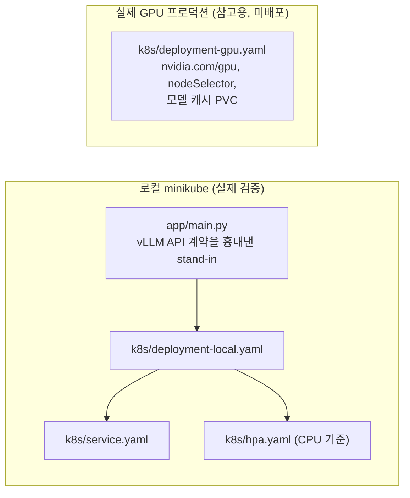

# vLLM 서빙 Kubernetes 배포 실습

vLLM 서빙을 Kubernetes에 배포·운영하는 패턴(헬스체크, 롤링 업데이트, HPA)을
로컬 minikube 클러스터에 실제로 띄워서 검증하고, 서빙 워크로드를 관측하며
성능 회귀를 CI에서 자동으로 검출하는 파이프라인까지 만든 실습입니다.

## 왜 stand-in 서버를 쓰는가

> 이 환경엔 GPU가 없어서 실제 vLLM 컨테이너(수 GB 이미지, GPU 필요한 모델 로딩)로
> 로컬 클러스터를 검증할 수 없습니다. 대신 `app/main.py`에 vLLM의 OpenAI 호환
> API 계약(`/health`, `/v1/completions`, Prometheus 형식 `/metrics`)과 동일한
> 형태의 경량 stand-in 서버를 만들고, **배포 매니페스트 자체(롤링 업데이트,
> 헬스체크, HPA 스케일링 동작)를 실제로 로컬 클러스터에 띄워서 검증**했습니다.

실제 GPU 프로덕션 배포용 매니페스트는 [`k8s/deployment-gpu.yaml`](k8s/deployment-gpu.yaml)에
별도로 정리했고, stand-in과의 차이(GPU 리소스 요청, 노드 셀렉터, 모델 캐시 PVC,
커스텀 메트릭 기반 HPA)를 주석으로 명시했습니다.

## 구조



## 검증한 것

1. **롤링 업데이트**: `maxUnavailable: 0` 설정으로 배포 중에도 서빙 가능한 파드 수가 줄지 않는지 확인
2. **헬스체크**: readiness probe가 실패한 파드를 서비스 엔드포인트에서 제외하는지 확인
3. **HPA**: 부하를 걸어 CPU 사용률 기준으로 실제 스케일 아웃이 일어나는지 확인

## CI 성능 회귀 자동 검출

GitHub-hosted 러너엔 GPU가 없어서 실제 vLLM 추론 벤치마크는
CI에서 돌릴 수 없습니다. 대신 서버의 **요청 처리 오버헤드**(라우팅, 동시성 제어,
응답 직렬화 — 실제 vLLM 서버에도 똑같이 존재하는 "추론 자체가 아닌" 비용)를
CPU 전용으로 측정해서, `main.py`를 건드리는 PR이 이 오버헤드를 회귀시키는지
매 커밋마다 자동으로 검사합니다.

- [`app/bench_latency.py`](app/bench_latency.py) — `benchmarks/baseline.json`의 p50/p95와 비교, 25% 이상 느려지면 `exit 1`
- [`.github/workflows/benchmark.yml`](.github/workflows/benchmark.yml) — push/PR마다 자동 실행

**직접 검증**: 회귀 게이트가 실제로 작동하는지 확인하려고, `STANDIN_TOKENS_PER_SEC`를
일부러 낮춰서(가짜 슬로다운 주입) 돌려봤습니다.

```
정상: p50=1.05ms  p95=1.20ms  → OK (baseline 대비 25% 이내)
주입된 회귀: p50=325.8ms  p95=327.9ms  → 성능 회귀 감지, exit 1
```

## 재현 방법
```bash
minikube start --driver=docker
cd app && docker build -t vllm-standin:local . && cd ..
minikube image load vllm-standin:local
kubectl apply -f k8s/deployment-local.yaml -f k8s/service.yaml -f k8s/hpa.yaml
kubectl rollout status deployment/vllm-standin
```

## 한계 (정직하게 명시)
- GPU 없이 stand-in으로 검증했으므로 실제 vLLM의 콜드스타트 시간(모델 로딩), 메모리 사용 패턴, 실제 추론 지연은 반영되지 않음
- HPA는 CPU 기준 — 실제 GPU 서빙에서는 `vllm:num_requests_waiting` 같은 커스텀 지표(Prometheus Adapter 필요)가 훨씬 의미 있음, `k8s/hpa.yaml` 주석에 명시
- 단일 노드 로컬 클러스터라 멀티 노드 스케줄링/장애 격리는 검증하지 않음
