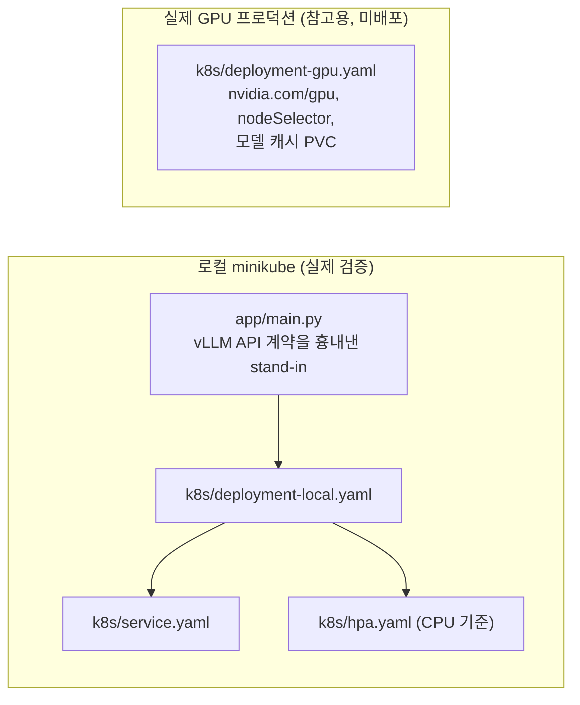

# vLLM 서빙 Kubernetes 배포 실습

vLLM 서빙을 Kubernetes에 배포·운영하는 패턴(헬스체크, 롤링 업데이트, HPA)을
로컬 minikube 클러스터에 실제로 띄워서 검증하고, 서빙 워크로드를 관측하며
성능 회귀를 CI에서 자동으로 검출하는 파이프라인까지 만든 실습입니다.

## 왜 stand-in 서버를 쓰는가

> 이 환경엔 GPU가 없어서 실제 vLLM 컨테이너(수 GB 이미지, GPU 필요한 모델 로딩)로
> 로컬 클러스터를 검증할 수 없습니다. 대신 `app/main.py`에 vLLM의 OpenAI 호환
> API 계약(`/health`, `/v1/completions`, Prometheus 형식 `/metrics`)과 동일한
> 형태의 경량 stand-in 서버를 만들고, **배포 매니페스트 자체(롤링 업데이트,
> 헬스체크, HPA 스케일링 동작)를 실제로 로컬 클러스터에 띄워서 검증**했습니다.

실제 GPU 프로덕션 배포용 매니페스트는 [`k8s/deployment-gpu.yaml`](k8s/deployment-gpu.yaml)에
별도로 정리했고, stand-in과의 차이(GPU 리소스 요청, 노드 셀렉터, 모델 캐시 PVC,
커스텀 메트릭 기반 HPA)를 주석으로 명시했습니다.

## 구조



## 검증한 것 (실제로 로컬 minikube에 띄워서 확인)

### 1. 배포 + 서비스 디스커버리
`kubectl apply` 후 파드 2개가 `Running`, 서비스 경유 `/health`·`/v1/completions`·`/metrics` 전부 정상 응답 확인.

### 2. 롤링 업데이트 — 무중단 확인
`kubectl set env`로 새 리비전을 트리거하고 `kubectl get pods`를 관찰:
```
새 파드 2개 기동 → 기존 파드 1개 Terminating (2 → 3 → 2, maxUnavailable=0 그대로 지켜짐)
deployment "vllm-standin" successfully rolled out
```

### 3. HPA — CPU 기준 지표의 한계를 실측으로 재현
`hpa.yaml` 주석에 "CPU 기준 HPA는 GPU 서빙에 안 맞을 수 있다"고 적어뒀던 걸, 실제로 부하를 걸어 직접 확인했습니다.
동시 요청 200개를 쏴서 서버를 동시성 한도(4)까지 채우고 큐를 쌓아본 결과:

| 지표 | 값 |
|---|---|
| `kubectl top pods` CPU | 파드당 3m (거의 유휴) |
| `kubectl get hpa` | `cpu: 3%/50%` — 타겟의 1/16 수준 |
| `standin_num_requests_running` | 4 (동시성 한도 포화) |
| `standin_num_requests_waiting` | **18** (요청이 밀려서 대기 중) |

**핵심**: 대기열에 18개나 밀려 있는데도(명백히 스케일 아웃이 필요한 상황) CPU는 3%라 HPA가 `50%` 타겟을 절대 못 넘겨서 스케일 아웃이 일어나지 않습니다 — I/O-bound(이 stand-in) 또는 GPU-bound(실제 vLLM) 워크로드에서 CPU 기준 HPA가 왜 무의미한지를 숫자로 직접 재현한 것입니다. 실제 배포에서는 `standin_num_requests_waiting`과 같은 형태인 vLLM의 `vllm:num_requests_waiting`을 Prometheus Adapter로 노출해서 그 지표로 스케일해야 함 (`k8s/hpa.yaml` 주석 참고).

### 4. 디버깅 중 실제로 부딪힌 문제
처음엔 `docker build`가 기본으로 만드는 attestation/provenance 매니페스트가 원인인 줄 알았습니다(`exec format error`로 크래시루프). `--provenance=false`로 재빌드했는데도 똑같이 재현돼서 그 가설은 틀렸다는 걸 확인했고, `minikube ssh -- crictl images`로 실제 노드 안의 이미지 ID를 직접 까보니 재빌드 전의 옛날 이미지 ID 그대로였습니다.

`minikube image load`는 `--overwrite=true`가 기본값이라 당연히 새 이미지로 덮어써질 거라 생각했는데, **이미 실행 중인 파드가 그 이미지를 참조하고 있으면 containerd 레벨에서 덮어쓰기가 조용히(에러 없이) 무시**된다는 걸 직접 겪고 알았습니다. `kubectl scale --replicas=0`으로 이미지를 물고 있는 컨테이너부터 없앤 뒤 `minikube image rm` → 재로드하니 새 이미지 ID로 정상 교체됐습니다.

## CI 성능 회귀 자동 검출

GitHub-hosted 러너엔 GPU가 없어서 실제 vLLM 추론 벤치마크는
CI에서 돌릴 수 없습니다. 대신 서버의 **요청 처리 오버헤드**(라우팅, 동시성 제어,
응답 직렬화 — 실제 vLLM 서버에도 똑같이 존재하는 "추론 자체가 아닌" 비용)를
CPU 전용으로 측정해서, `main.py`를 건드리는 PR이 이 오버헤드를 회귀시키는지
매 커밋마다 자동으로 검사합니다.

- [`app/bench_latency.py`](app/bench_latency.py) — `benchmarks/baseline.json`의 p50/p95와 비교, 25% 이상 느려지면 `exit 1`
- [`.github/workflows/benchmark.yml`](.github/workflows/benchmark.yml) — push/PR마다 자동 실행

**직접 검증**: 회귀 게이트가 실제로 작동하는지 확인하려고, `STANDIN_TOKENS_PER_SEC`를
일부러 낮춰서(가짜 슬로다운 주입) 돌려봤습니다.

```
정상: p50=1.05ms  p95=1.20ms  → OK (baseline 대비 25% 이내)
주입된 회귀: p50=325.8ms  p95=327.9ms  → 성능 회귀 감지, exit 1
```

**실제 CI에 올려보고서야 발견한 문제**: baseline을 로컬 Mac에서 만들어서 커밋했더니, 실제 GitHub Actions(`ubuntu-latest`) 첫 실행이 **진짜로 실패**했습니다 — `p50_ms: 2.38ms > baseline 1.082ms + 25% 허용치`. 코드는 전혀 안 바뀌었는데 회귀로 잡힌 것: 로컬 Mac과 GitHub-hosted 러너의 CPU 성능/가상화 오버헤드가 달라서 baseline 자체가 애초에 안 맞았던 것입니다. **baseline은 반드시 그 baseline과 비교할 환경(여기선 CI 러너) 안에서 만들어야 한다**는, 벤치마크 자동화에서 흔히 놓치는 함정을 직접 겪었습니다 — CI에서 실측된 `p50=2.38ms/p95=2.739ms`로 baseline을 다시 잡아서 고쳤습니다.

## 재현 방법
```bash
minikube start --driver=docker
cd app && docker build --provenance=false -t vllm-standin:local . && cd ..
minikube image load vllm-standin:local                # 같은 태그를 재빌드했다면 아래 4번 참고 (실행 중인 파드가 있으면 이 재로드가 조용히 무시됨)
minikube addons enable metrics-server                # HPA CPU 지표용
kubectl apply -f k8s/deployment-local.yaml -f k8s/service.yaml -f k8s/hpa.yaml
kubectl rollout status deployment/vllm-standin
```

## 한계 (정직하게 명시)
- GPU 없이 stand-in으로 검증했으므로 실제 vLLM의 콜드스타트 시간(모델 로딩), 메모리 사용 패턴, 실제 추론 지연은 반영되지 않음
- HPA는 CPU 기준으로 구성했고, 위 3번 실험에서 이게 실제로 무의미하다는 것까지 확인함 — 실제 GPU 서빙에서는 `vllm:num_requests_waiting` 같은 커스텀 지표(Prometheus Adapter 필요)로 바꿔야 함, `k8s/hpa.yaml` 주석에 명시
- 단일 노드 로컬 클러스터라 멀티 노드 스케줄링/장애 격리는 검증하지 않음
